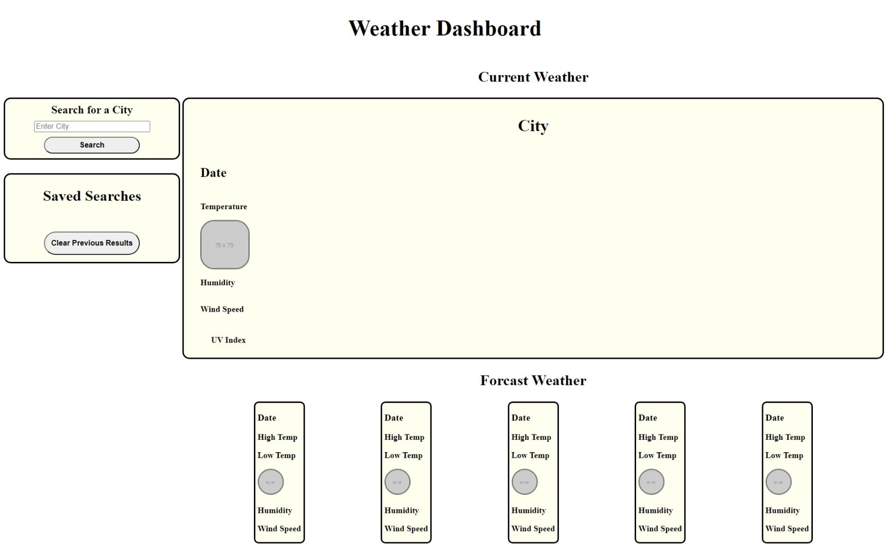
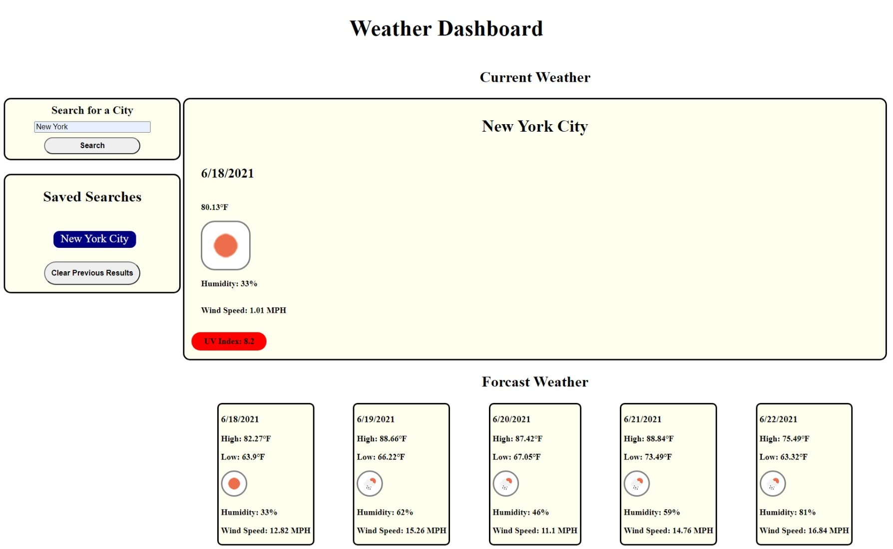
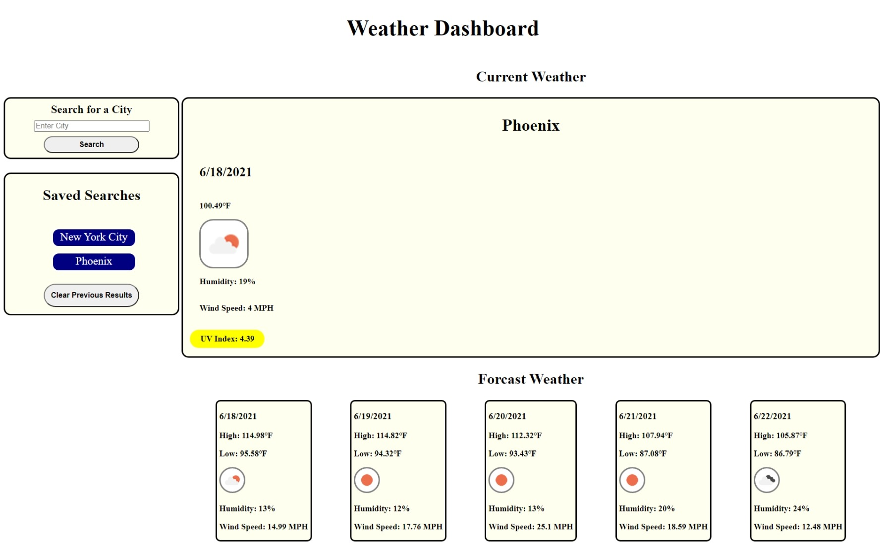
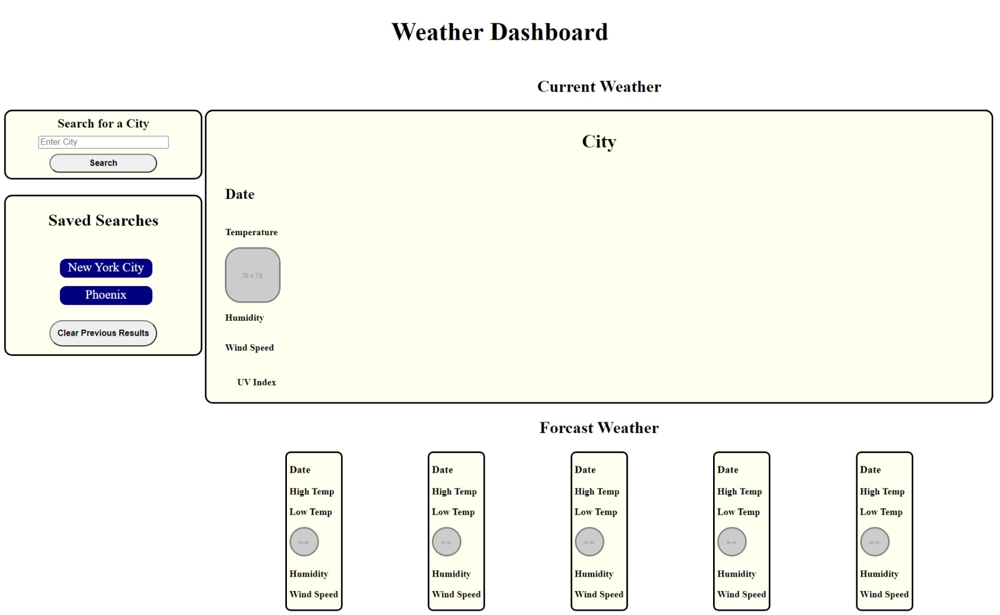

# Weather-Dashboard
---

## Description

In this assignment, I created a weather dashboard app that will allow the user to search by city to view the current temperature and forcasted weather. Previous city searches will appear allowing the user to quickly view weather details at a convenient click away.  Some of the skills demonstrated during this assisgnemt include but not limited to:
* Utilizing the Open Weather App API to retrieve current and forcasted weather from their servers.
* Pulling any necessary data from the API to provide the requested weather info, and appending it to the be viewed in the browser.
* Saving and retrieving city names in local storage to view and quickly search previously viewed cities, and to have previous searches populate when refresh page until the local storage is cleared.

---

## Image

Below are images of my completed weather dashboard app page.

---

## Resources

I utilized the following sites to assist in creating my weather dashboard app.
* https://www.w3schools.com/
* https://developer.mozilla.org/
* https://webdesign.tutsplus.com
* https://github.com/DenverCoder1

---

## Application

You can find my weather dashboard page at the following:

* https://jman4342.github.io/Weather-Dashboard/

---

## Questions
  If you have any questions, I can be reached on my GitHub at [JMan4342](https://github.com/JMan4342).

  You can also reach me by email at manning.joseph.4342@gmail.com.